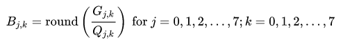
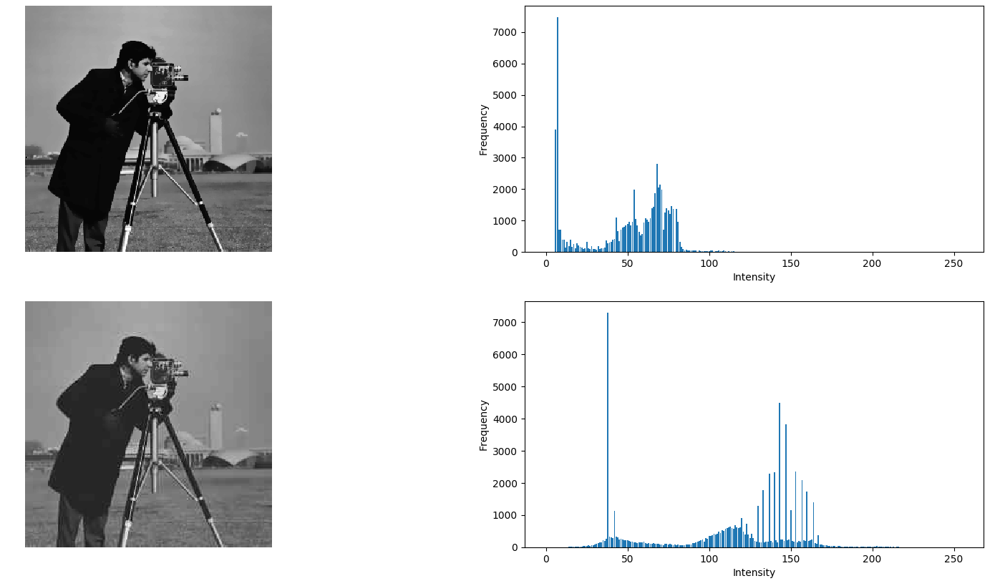
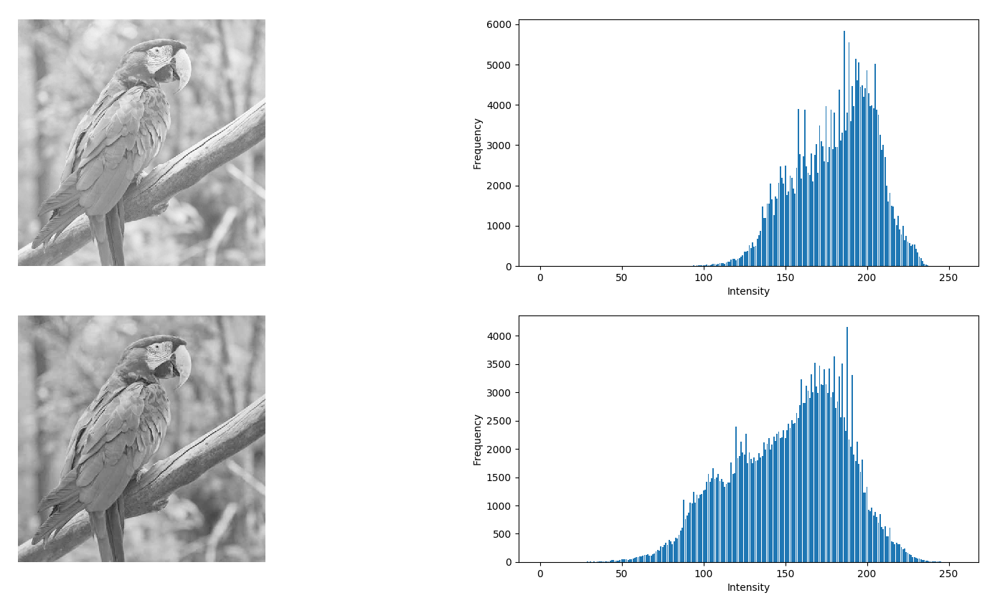
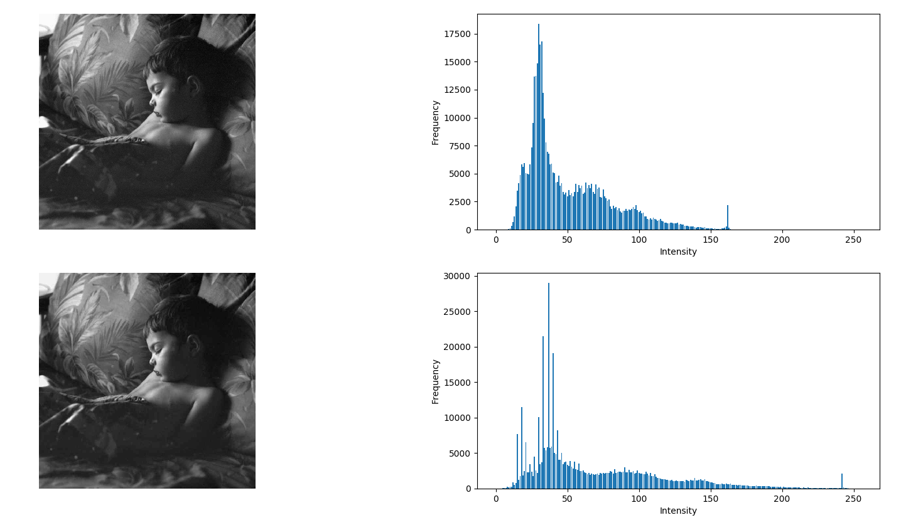
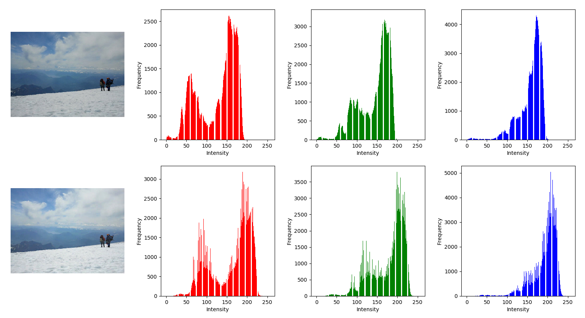
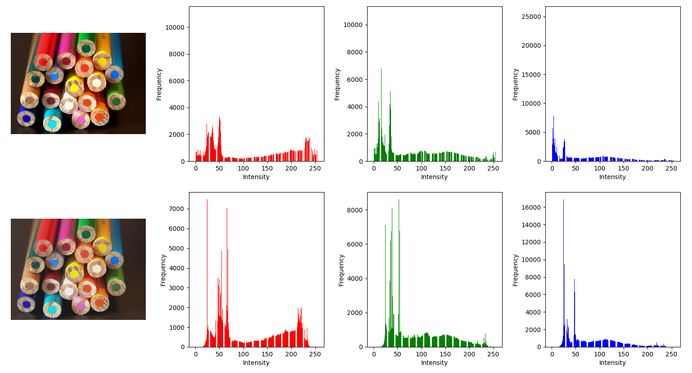
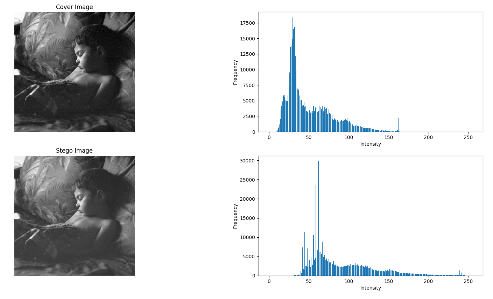
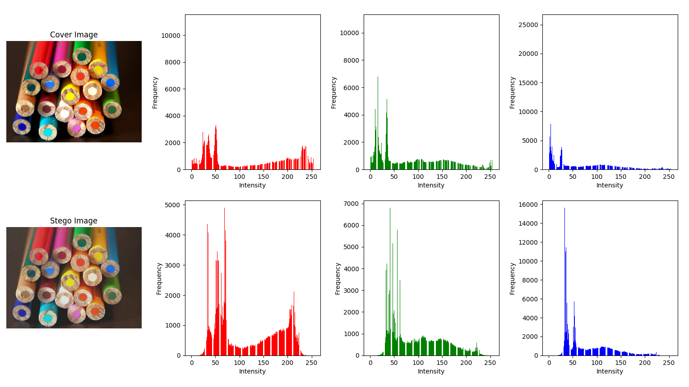
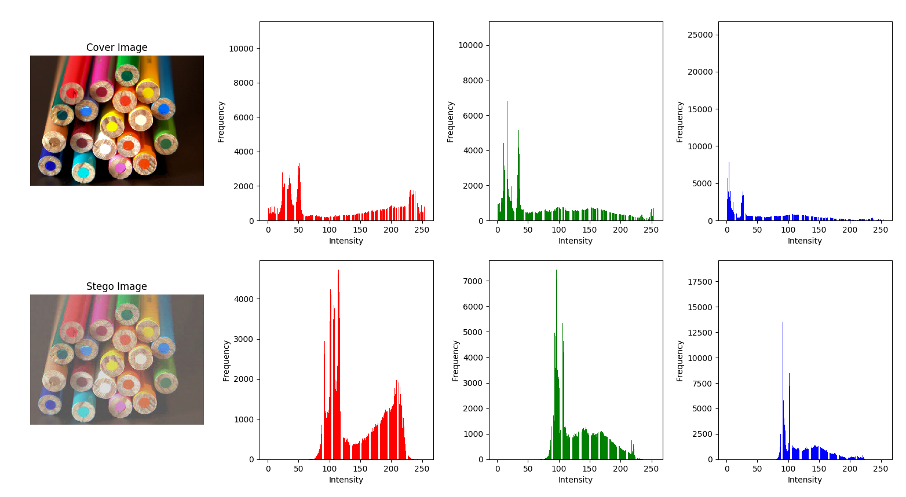
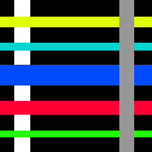

# Final Report
## Introduction
The main idea was accomplished (apply a steganography technique onto images in the frequency domain). This project is composed by only one file, `proj.py`, and currently I managed to achieve the following:
- Successfully apply DCT techniques in images;
- Recover image from DCT Coeficients with minimal visual difference;
- Apply DCT in all 3 channels of RGB images;
- Apply JSTEG steganography technique to hide information (although not as big as intended to be);
- Recover binary data from the stego image.  

The core functions are `img_dct()`, `img_recov()` and `retrieve_msg()`. They are, respectively, DCT and JSTEG application, image recover from DCT coeficients, retrieve message hidden in the stego image.  

This project is dependent on numpy, scipy (fftpack module), bitstring, imageio and matplotlib (pyplot module).

## Main problems encountered:
- Lack of knowledge on how the methods intended to work;
    - Understanding the concept of the compression technique;
- Problems with pre-processing and post-processing arrays and types (overflow, normalization, etc.);
- Problems when working with binary data and bitarrays in Python and its data structures.
    - Python has a slightly different approach to bits and binary data than what I am familiar with
It was intended to implement the F5 algorithm as well, but due to lack of time right now, I didn't get a chance take a deeper look into it. So JSTEG was the chosen as it's simple enough to be a PoC.

## Steps description
### DCT compression + JSTEG
A image compression technique in the frequency domain. The method consists in trying to represent the whole image using only cosine functions. These are pre-made functions and we only need to calculate its coeficients, following the equation:  
  
This is applied to every 8x8 pixel block of the image, and because of that, zero-padding is done when the image dimension is not divisible by 8. Next, the calculated coeficients are real numbers, so we apply a quantization step (followed by rounding) in order get integer numbers as it is a lot easier to work with when dealing with binary data and its bits.  
  
After we have the DCT coeficients, we can start to embed our secret data. In short, JSTEG is the LSB technique applied to the DCT coeficients.  
After embeding data, we can merge all the 8x8 blocks and recover the image by undoing the quantization and applying the inverse DCT (IDCT). Using this approach, we can obtain very good results, here are some examples (original image at the top and dct compressed and recovered image at the bottom):  
  
  
  

And besides, we can apply DCT technique on multiple channels!:  
  

  
  

And so, after testing the compression, these are some results of embeding data:  
Running:
```
python proj.py images/nap.jpg check.png
```
  
Embeding the image   

Running:
```
python proj.py images/pencil.png images/pattern.png
```
  
Embeding the image  
  


Running: (Notice the `2` at the end. It means that we are using 2 LSB to embed data)

```
python proj.py images/pencil.png images/colors.png 2
```  

  
Embeding the image  
  


## Conclusions and thoughts
After applying the JSTEG technique, it chages quite a bit the image, even using 1 LSB (the default one in this program). Using 2 LSB we can store more data, but there are a significant change in the final result of the stego image. Here, this seemed to be quite inefficient, but this is still a very raw PoC and there are a very little optimization done on this code.  
Still, I am happy with the results that it was possible to compress the image using a new approach (to me) and at least being able to store and successfully recover data from images. While researching for references, there was a intersting project of someone that applied these techniques to embed images to .mp4 videos, this showed me that we can expand these techniques to build some really cool applications that is not restricted to one type of media.