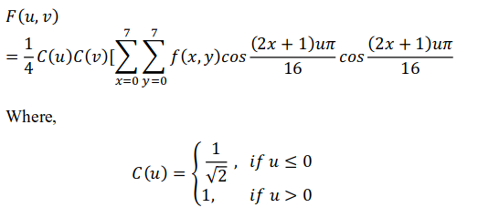
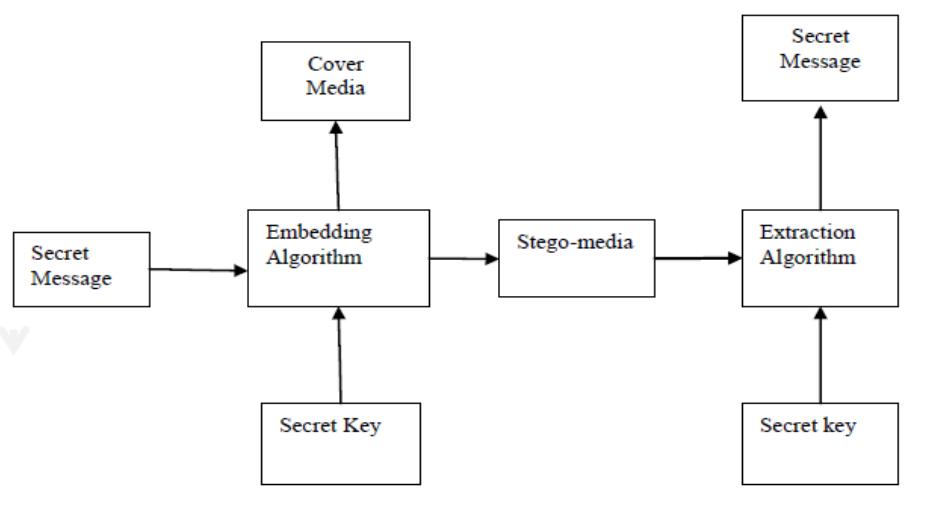

# JPEG Steganography

## What is steganography?
_"Hiding messages inside other messages"_  
  
## The project
Use steganography technique using DCT (Discrete Cosine Transform) to embed data inside a image.

### DCT
This is a compression technique for JPEG images. Here, we represent the image with coeficients of 8x8 (64) cosine functions:  
  
  
In short, we divide the cover image in 8x8 blocks, and try to represent each of these blocks with coeficients of the cosine functions. We calculate the DCT coeficients with the given transformation:  
  

Then, we quantitize the coeficients using a pre-made quantization table in order to get integer values

After obtaining the coeficients, we use them to hide image (for testing purposes, LSB is used over the coeficients), and then generate the final image.  
